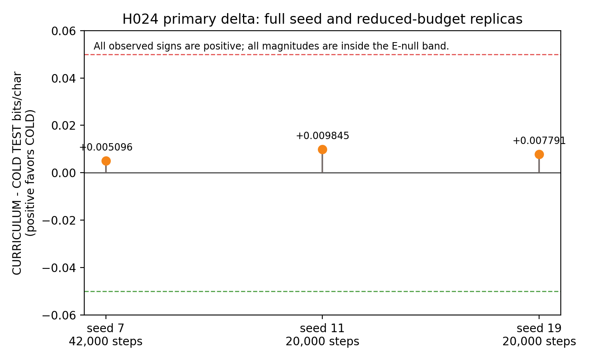
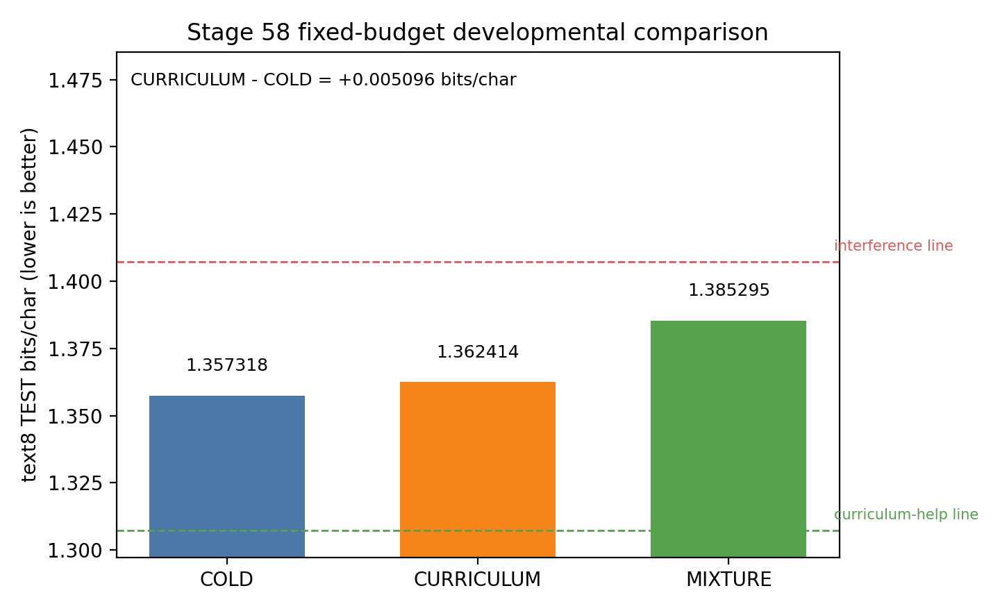
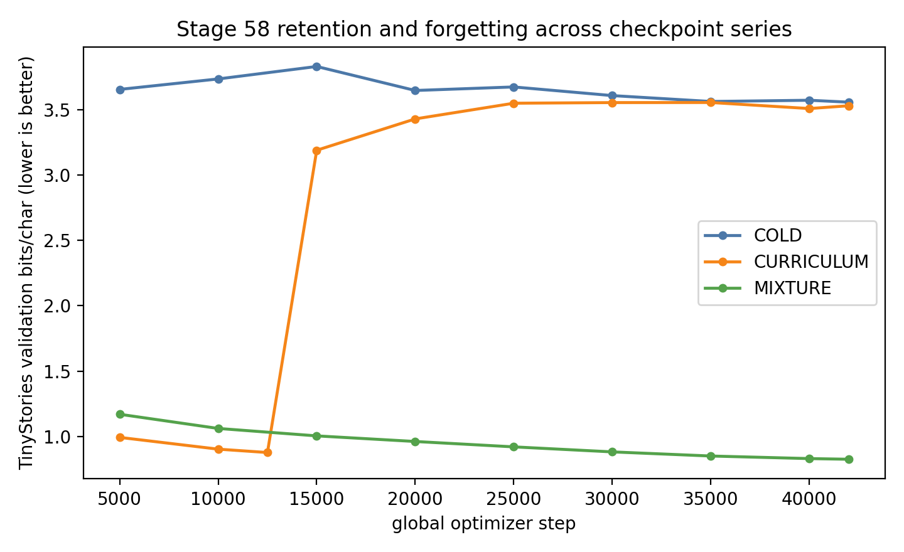

# Phase 5 Scientific Closeout

Date: 2026-07-21 local

Status: EMPIRICAL PROGRAM COMPLETE. Phase 5 established the cause of the
specialization gap, locked the usable recipe, and completed the registered H024
developmental comparison with its required reduced-budget sign replicas.
Release actions remain deliberately user-gated.

## Executive Verdict

The measured specialization gap is a data-distribution effect, not evidence
against the character-level substrate. A learned TinyStories childhood does not
earn back the broad-text exposure it displaces at the registered H024 budget.

The primary Stage 58 contrast is CURRICULUM minus COLD on deterministic,
chunked text8 TEST bits/char. Seed 7 gives `+0.005096`, which is inside the
pre-registered `+/-0.05` E-null band. Reduced-budget seeds 11 and 19 give
`+0.009845` and `+0.007791`, respectively. All three signs favor COLD, but all
three magnitudes are practically null under the registered decision rule.

H024 verdict: **E-null, seed-robust in sign.** No full-budget escalation is
required because the seed-7 margin is not marginal and both reduced-budget
replicas reproduce its sign.

## What Phase 5 Established

| Workstream | Registered question | Result |
| --- | --- | --- |
| H022, Stage 56 | Is the narrow-to-broad gap caused by the substrate or the data distribution? | CONFIRM for data distribution: seed-7 broad training scored `1.485740` text8 TEST bits/char at 50,000 steps, below the `1.70` line. |
| Stage 57 Recipe v2 | Which training recipe is justified by measurements? | fp32 retained; bf16 rejected on throughput; cosine adopted after a `-0.068177` sampled-NLL gain; union-vocabulary and checkpoint-retention smokes passed. |
| Behavior probe | Does the flagship reopen the memorization-proof copy axis? | No: `0.060547` accuracy versus `0.062500` chance. |
| H024, Stage 58 | Does developmental order improve broad-text learning at fixed compute? | No practical broad-text effect. CURRICULUM is slightly worse by sign in all three evaluated seeds, but every delta is inside E-null. |

## Progress From Phase 4

Phase 4 established that the lab could train, resume, validate, and export a
201.6M-parameter TinyStories flagship. Its deterministic zero-shot text8 TEST
score was `2.8817` bits/char. Phase 5 then turned the resulting specialization
gap into a causal question: Stage 56 trained an 85.11M-parameter model on broad
text for 50,000 steps and reached `1.485740` text8 TEST bits/char. That is an
absolute improvement of `1.395960` bits/char, or about 48.4 percent lower
bits/char on the shared external test.

This is not a capacity-matched leaderboard comparison: corpus, model size, and
training recipe differ. Its evidential value is stronger and narrower. A
smaller broad-data model substantially closes the Phase-4 external gap, so the
gap is principally a data-distribution effect. H024 then tests whether a
TinyStories childhood can retain that developmental benefit while holding total
compute fixed. The answer at the registered dose is practically null.
## H024 Primary Evidence

All rows use deterministic text8 TEST scoring over 4,999,936 characters with
chunked non-overlapping windows and context resets. Lower is better.

| Seed | Budget | COLD | CURRICULUM | CURRICULUM minus COLD |
| ---: | ---: | ---: | ---: | ---: |
| 7 | 42,000 | 1.357318 | 1.362414 | +0.005096 |
| 11 | 20,000 | 1.410154 | 1.419999 | +0.009845 |
| 19 | 20,000 | 1.410779 | 1.418571 | +0.007791 |

Descriptive delta summary: mean `+0.007578` bits/char, sample SD `0.002381`,
range `+0.005096` to `+0.009845`. These are not pooled full-budget estimates:
only seed 7 ran at the decision budget, while seeds 11 and 19 test the
pre-registered direction at the reduced budget.

## Seed-7 Three-Arm Evidence

| Arm | text8 TEST bits/char | Delta versus COLD | Final TinyStories retention bits/char |
| --- | ---: | ---: | ---: |
| COLD | 1.357318 | baseline | 3.556502 |
| CURRICULUM | 1.362414 | +0.005096 | 3.529069 |
| MIXTURE | 1.385295 | +0.027977 | 0.826285 |

MIXTURE is `+0.022881` bits/char relative to CURRICULUM. Both secondary
broad-text contrasts remain inside their registered `0.05` practical line.

## Retention Is Real but Does Not Change the Primary Verdict

The retention manipulation worked exactly in the descriptive sense it was
designed to test. MIXTURE finishes `2.730217` TinyStories bits/char better than
COLD and `2.702784` better than CURRICULUM. CURRICULUM initially learns
TinyStories well, then forgets sharply when broad training begins. MIXTURE
maintains its rehearsal advantage throughout the checkpoint series.

That retention result does not override the primary metric. Under fixed total
compute, neither front-loaded nor interleaved childhood improves held-out text8
TEST enough to cross the practical threshold.

## Stability and Run Integrity

The H024 instability guard compares each full seed-7 arm's final sampled broad
validation NLL to its own step-25,000 value. Every arm improves and passes.

| Arm | Step-25,000 NLL | Final sampled NLL | Final minus step 25,000 | Guard |
| --- | ---: | ---: | ---: | --- |
| COLD | 0.986930 | 0.884350 | -0.102580 | PASS |
| CURRICULUM | 0.985283 | 0.920510 | -0.064773 | PASS |
| MIXTURE | 1.007650 | 0.905836 | -0.101814 | PASS |

The seed-19 COLD continuation originally failed its final checkpoint write in
Codex's restricted workspace-write context. An unrestricted atomic PyTorch
preflight in `C:\cassandra_runs` passed, demonstrating a containment issue
rather than a disk, ACL, or hardware failure. The compliant external visible
launcher reran COLD successfully from the audited step-15,000 checkpoint. The
subsequent seed-19 curriculum restart used one-thousand-step recovery
checkpoints; its phase 1 and phase 2 finals, JSONL rows, summaries, and TEST
report all completed cleanly.

## Interpretation and Limits

- This is a fixed-compute conclusion: childhood consumed broad-text exposure.
  It does not say TinyStories pretraining can never help when added compute is
  available.
- The full decision-budget result has one seed. The two 20,000-step replicas
  establish robustness of direction, not equality of effect magnitude at
  42,000 steps.
- MIXTURE versus CURRICULUM is an order-plus-learning-rate-regime comparison:
  front-loading places broad learning later in one continuous cosine schedule.
- The null result is a practical decision under the registered 0.05 bits/char
  threshold, not proof of exact equivalence.

## Durable Artifacts

- `experiments/tiny_language_lab/RESULTS.md`
- `docs/phase5-developmental-midrun-report.md`
- `docs/phase5-completion-audit.md`
- `docs/figures/phase5/stage58_developmental_comparison.md`
- `docs/figures/phase5/h024_replica_sign_check.md`
- `docs/figures/phase5/fig1_stage58_text8_primary.png`
- `docs/figures/phase5/fig2_stage58_tinystories_retention.png`
- `docs/figures/phase5/fig3_h024_replica_sign_check.png`
- `docs/figures/phase5/fig4_phase5_arc_and_recipe.png` (added at closeout:
  the Phase 5 arc and the matched-budget Recipe v1 versus v2 contrast)
- `docs/decisions/0016-phase-5-closeout-developmental-null-recipe-frontier.md`

## Deliberately Deferred User Decisions

Nothing in this closeout authorizes a public push, history rewrite, license
selection, or release. Those actions remain subject to the user's explicit
sign-off, as do the Round-2 A/B votes for the release narrative.
